# Web_Programming_Lab

To Run the Programs run

```bash
google-chrome ./index.html
```

## Programs Outputs
1. **Create a form with the elements of Textboxes, Radio buttons, Checkboxes, and so on. Write JavaScript code to validate the format in email, and mobile number in 10 characters, If a textbox has been left empty, popup an alert indicating when email, mobile number and textbox has been left empty**

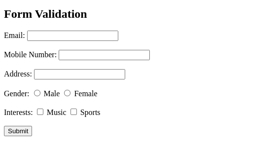
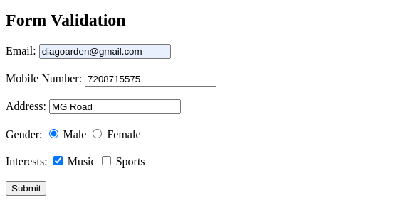

2. **Develop an HTML Form, which accepts any Mathematical expression. Write JavaScript code to Evaluate the expression and Display the result.**

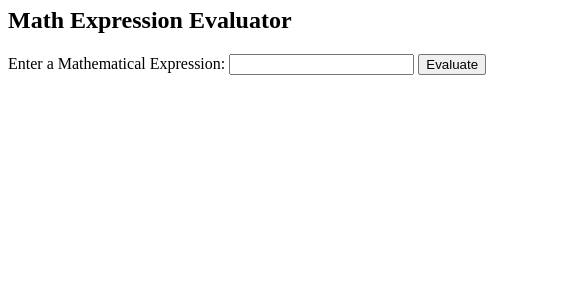
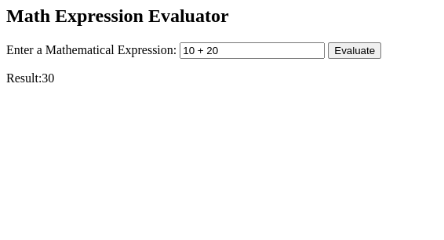


3. **Develop an HTML Form, which accepts any Mathematical expression. Write JavaScript code to Evaluate the expression and Display the result.**


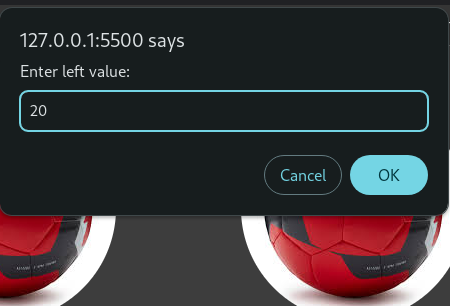


4. **Write a JavaScript code to find the sum of N natural Numbers. (Use user-defined function)**
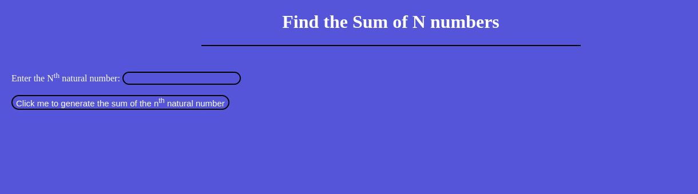
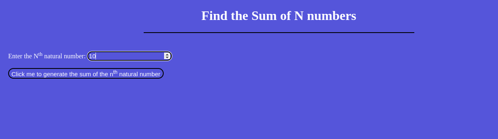
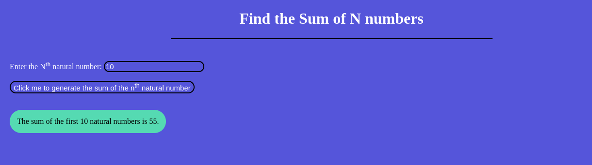

5. **Write a JavaScript code block using arrays and generate the current date in words, this should include the day, month and year.**

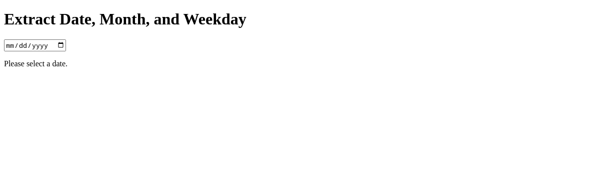
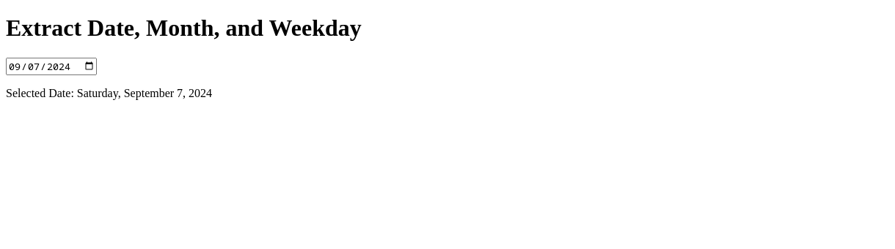

6. **Create a form for Student information. Write JavaScript code to find Total, Average, Result and Grade.**

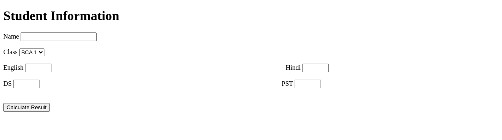
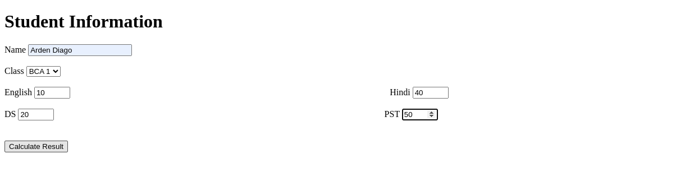
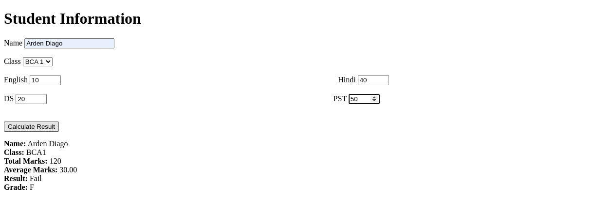 